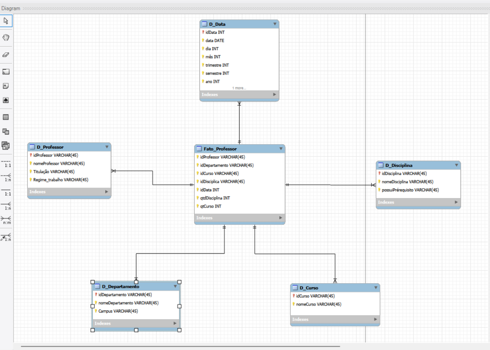

# Modelagem Dimensional de Universidade (Star Schema)

## Sobre o projeto

Este projeto foi desenvolvido com o objetivo de transformar um modelo relacional de uma universidade em um modelo dimensional do tipo Star Schema, com foco na análise de dados dos professores.

A proposta consistiu em identificar quais informações do modelo original eram relevantes para análises gerenciais e organizá-las em uma estrutura adequada para Data Warehouse e Business Intelligence.

O desenvolvimento foi realizado utilizando MySQL Workbench.

---

## Objetivo

Criar um modelo dimensional voltado para a análise de professores, considerando informações relacionadas a:

- Departamento de atuação
- Cursos vinculados
- Disciplinas ministradas
- Datas de oferta
- Indicadores quantitativos para análise

O modelo não contempla dados de alunos, conforme especificação da atividade.

---

## Estrutura do Modelo

### Tabela Fato

**Fato_Professor**

Armazena os eventos analisados e contém as chaves que se relacionam com as dimensões do modelo.

Principais campos:

- idProfessor
- idDepartamento
- idCurso
- idDisciplina
- idData
- qtdDisciplina
- qtdCurso

---

### Dimensões

#### D_Professor

Informações relacionadas aos professores.

#### D_Departamento

Informações dos departamentos e campus.

#### D_Curso

Dados dos cursos oferecidos pela instituição.

#### D_Disciplina

Dados das disciplinas ministradas.

#### D_Data

Dimensão temporal utilizada para análises por período.

---

## Granularidade

Cada registro da tabela fato representa um professor ministrando uma disciplina em um curso específico, pertencente a um departamento e associado a uma determinada data.

---

## Tecnologias Utilizadas

- MySQL Workbench
- Modelagem Relacional
- Modelagem Dimensional
- Star Schema
- Data Warehouse

## Modelo Dimensional (Star Schema)

